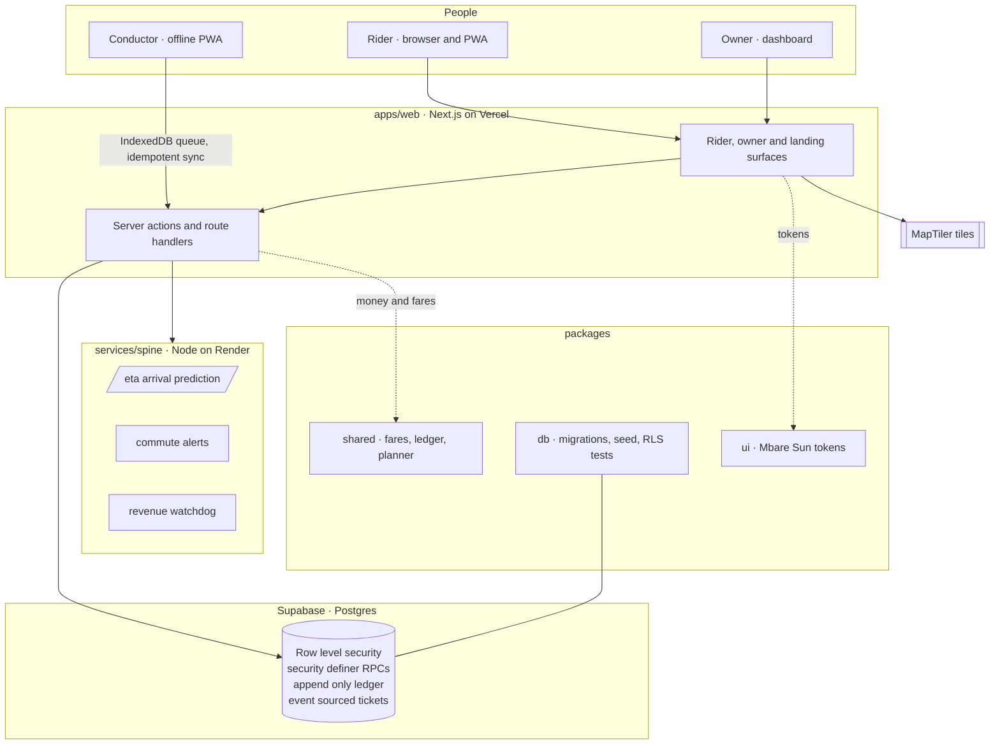
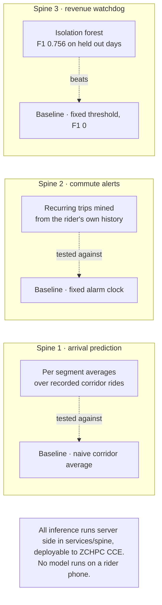
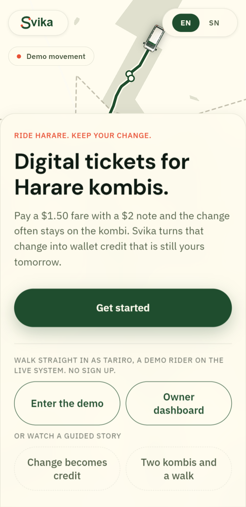
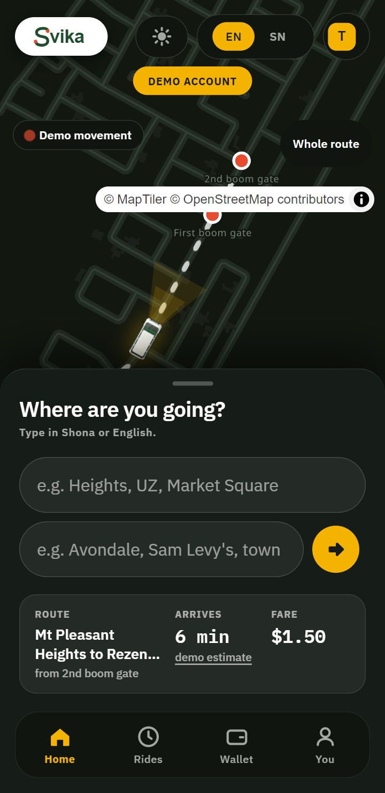
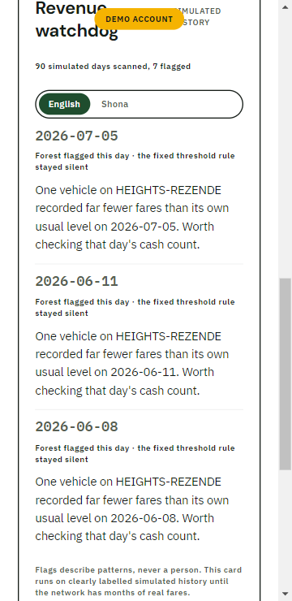
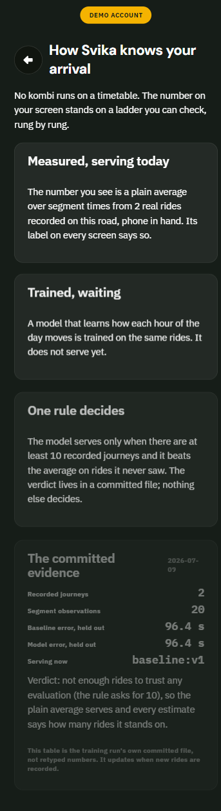

<div align="center">


### A safe ride home, someone who knows where you are, and the change that stays yours.

Trip intelligence for Harare's informal kombi network.

<br/>

[](https://svika-web.vercel.app)
&nbsp;
[](docs/proposal/Svika_AI4I_Proposal_Development.pdf)

[](https://github.com/takmaswi/svika-ai4i/actions/workflows/ci.yml)
&nbsp;

&nbsp;


</div>

---

## What Svika is

A rider in Harare gets on a kombi with no timetable, pays cash, and often never sees their change again. If something goes wrong on the road, nobody they trust knows where they are. Svika is built around those two problems first: getting home safely and keeping the money that is yours.

The rider plans a trip in Shona or English, boards with a short code, and any change the conductor cannot give back becomes wallet credit instead of leaving on the kombi. A Zimbabwean voice calls the stops so a rider who cannot read the route, or cannot see the window, still knows when to get off. A rider can share a live link so someone at home watches the trip to the door. Emergency next of kin details sit behind a locked path that no other account can read.

The digital ticket is how the network pays for itself, and it is real: a double entry ledger, event sourced tickets, and row level security on every table. But the product is passenger first. Owners get honest revenue and a watchdog on leakage. Conductors clear fares offline and earn commission. Underneath, three server side AI jobs do work a query or a rule cannot: predicting arrival with no timetable, learning a rider's commute, and finding revenue leakage hiding inside one kombi's takings.

Built for the POTRAZ AI for Impact Challenge 2026, Track 3, bootcamp in Mutare, 27 July to 1 August 2026.

---

## Architecture



Money never moves through app code holding a service key. Writes go through security definer RPCs, and every table carries row level security from its first migration. The conductor app queues writes in IndexedDB and reconciles on first sync, so a fare cleared with no signal is not a lost fare.

---

## The three AI spines

Each spine keeps a named baseline and a committed evaluation. If a rule or a query would do the job, the job is done with a rule and labelled as one. No feature is dressed up as AI to score points.



- **Arrival prediction** serves per segment averages over the two corridor rides recorded on 7 July 2026. The trained model is promoted only when it beats the baseline with at least ten recorded journeys. Today the verdict is insufficient data, so the baseline serves and every estimate shows how many recorded rides it stands on (`services/spine/metrics`).
- **Commute alerts** are deliberately plain statistics: recurring trips mined inside the rider's own row level security scope, fired only when the live wait clears a threshold. The alarm clock baseline cannot know today's supply, which is the point (`docs/SPINE-2-COMMUTE-ALERTS.md`).
- **Revenue watchdog** is an isolation forest scored against a fixed threshold on held out labelled days. The forest reaches F1 0.756; the threshold scores 0 because the leakage hides inside one kombi's takings (`services/spine/metrics/WATCHDOG-METRICS.md`). Its explanations flag a pattern and never name a person, proven by a unit test.

---

## What it looks like

Day surfaces are pure white with marigold and forest. Night is the char canvas. Every screen is built for a cheap Android at 360px, and works in both English and Shona.

<table>
<tr>
<td width="50%" align="center"><br/><sub>Landing, day</sub></td>
<td width="50%" align="center"><br/><sub>Rider home, night</sub></td>
</tr>
<tr>
<td width="50%" align="center"><br/><sub>Owner watchdog, day</sub></td>
<td width="50%" align="center"><br/><sub>Arrival intelligence, night</sub></td>
</tr>
</table>

More day and night captures live in [`docs/design-evidence`](docs/design-evidence).

---

## Security and money

The rubric puts thirty percent on code quality, and this is where it lands.

- **Row level security on every table, from the first migration.** The service role key exists only in the seed script and CI secrets, never in app code. An automated suite signs in as two real riders and proves one cannot read the other's tickets or wallet.
- **Money is a double entry, append only ledger.** No mutable balance columns. Money moves only through security definer RPCs, and invariant tests prove money cannot be created, lost, or double spent before any wallet feature merges.
- **Tickets are event sourced.** State changes append `ticket_events` rows. History is never overwritten.
- **Board codes are scoped and rate limited.** Four digits, bound to route, direction and time window, with every redemption attempt logged.

### Tests

| Suite | What it proves | Command |
| --- | --- | --- |
| Unit, 296 passing | Fares, ledger, planner, ETA, voice triggers, watchdog, i18n parity | `pnpm test` |
| RLS isolation, 102 checks | One rider cannot reach another rider's rows | `pnpm db:security-test` |
| Ledger invariants | Money is conserved across every RPC | `pnpm db:ledger-test` |
| End to end, 21 flows | Rider, conductor and owner journeys in Playwright | `pnpm test:e2e` |

Unit counts by package: shared 35, web 135, spine 89, conductor 37. CI runs typecheck, lint and unit on every push and pull request (`.github/workflows/ci.yml`); the RLS and end to end suites run at each phase gate, where they can reach the seeded database. The latest gate counts are logged in [`docs/BUILD-LOG.md`](docs/BUILD-LOG.md).

---

## Honesty tiers

Every feature is labelled, on screen and in the [demo disclosure register](docs/DISCLOSURE-REGISTER.md), which a judge can also open in the running app at [`/register`](https://svika-web.vercel.app/register).

- **Tier 1** is real and working against the live database.
- **Tier 2** is clickable with a fixed or simulated backend, and always says so on screen.
- **Tier 3** lives in slides only and never in code.

| Feature | Tier | Note |
| --- | --- | --- |
| Trip planning and fare quotes | 1 | Graph planner over the seeded network; fares from dated segments in Postgres |
| Digital ticket, board code, redemption | 1 | Double entry ledger, scoped and rate limited codes |
| Change to wallet credit, split a note, transfers | 1 | Ledger operations under row level security isolation tests |
| Offline conductor sync | 1 | IndexedDB cache and idempotent sync RPCs against the live database |
| Live map, corridor geometry and stops | 1 | Real road line and fifteen stop names from field GPS rides on 7 July 2026 |
| Live map, moving kombis | 2 | Simulated along the real road; no vehicle GPS feed yet, labelled on screen |
| Arrival estimate, the minutes | 1 | Served baseline over recorded rides, with its basis labelled |
| Arrival estimate, the kombi position | 2 | The same simulated fleet the map shows |
| Voice guidance, the trigger engine | 1 | Geofence engine with zero network at play time, proven by a unit test |
| Voice guidance, the recorded voices | 2 | Placeholder audio; consented Zimbabwean recordings replace the files in P5 |
| Share my ride | 1 | Capability links minted server side; the viewer sees route facts, never who is riding |
| Consent and privacy | 1 | First use consent gate over every surface, proven by an end to end test |
| Commute alerts, the engine | 1 | Plain statistics inside the rider's own scope, against the alarm clock baseline |
| Commute alerts, the demo history | 2 | Synthetic fixture commute, enumerated in a table, no money moved |
| Revenue watchdog, the detector | 1 | Isolation forest with a committed verdict against the fixed threshold baseline |
| Revenue watchdog, the history it scans | 2 | Seeded simulator; every row flagged synthetic and labelled on screen |
| Vision scenes, crash flow, USSD, capacity | 2 | Simulations, permanently stamped; the concepts they preview stay slides tier |

The register is the source of truth. When a feature changes tier, the register changes in the same commit.

---

## Quickstart

```bash
pnpm install
cp .env.example .env.local     # fill in Supabase and MapTiler keys
pnpm db:seed                   # seed the network, fares and demo accounts
pnpm --filter web dev          # rider and owner app on http://localhost:3000
```

The conductor app and the AI spine run alongside:

```bash
pnpm --filter conductor dev            # offline conductor PWA
pnpm --filter @svika/spine dev         # arrival, alerts and watchdog service
```

Every key is documented in [`.env.example`](.env.example). Secrets live in `.env.local` only, and never in the repo. The app runs without the spine and without an AI key: arrival estimates fall back to a labelled mock, and the text adapter uses its mock twin.

### Validation

```bash
pnpm typecheck && pnpm lint && pnpm test     # every change
pnpm test:e2e                                # phase gates
pnpm db:security-test                        # RLS proof, gates and any auth change
```

A red suite means not done.

---

## Workspace layout

```
apps/web         rider app, owner dashboard, landing (Next.js 15, React 19)
apps/conductor   offline first conductor PWA
services/spine   AI service: arrival prediction, commute alerts, revenue watchdog
packages/shared  types, fare and ledger logic (unit tested)
packages/db      migrations, seed, RLS and ledger security tests
packages/ui      Mbare Sun design tokens
```

## Stack

- **App**: Next.js 15, React 19, TypeScript, MapLibre GL with MapTiler tiles
- **Data**: Supabase Postgres with row level security and security definer RPCs
- **AI spine**: TypeScript on Node, isolation forest and baseline evaluators, deployable to ZCHPC CCE
- **Test**: Vitest for units, Playwright for end to end, custom Node harnesses for RLS and ledger
- **Deploy**: web on Vercel, spine on Render (see [`docs/DEPLOY.md`](docs/DEPLOY.md))

## Links

- Live demo: [svika-web.vercel.app](https://svika-web.vercel.app) (enter through the demo door, no sign up)
- Disclosure register on screen: [svika-web.vercel.app/register](https://svika-web.vercel.app/register)
- Proposal: [`docs/proposal/Svika_AI4I_Proposal_Development.pdf`](docs/proposal/Svika_AI4I_Proposal_Development.pdf)
- Dataset statement: [`docs/DATASET-STATEMENT.md`](docs/DATASET-STATEMENT.md)
- Working rules for the codebase: [`CLAUDE.md`](CLAUDE.md)

## License

Copyright 2026 Takunda Maswi. All rights reserved. Made publicly visible for competition adjudication and portfolio review. See [`LICENSE`](LICENSE).
